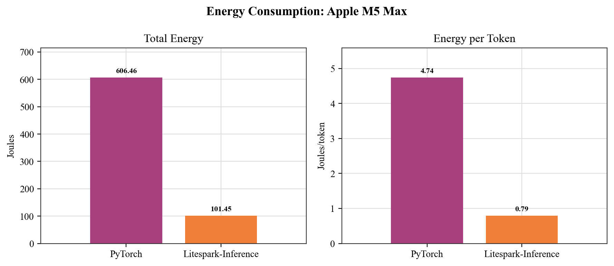
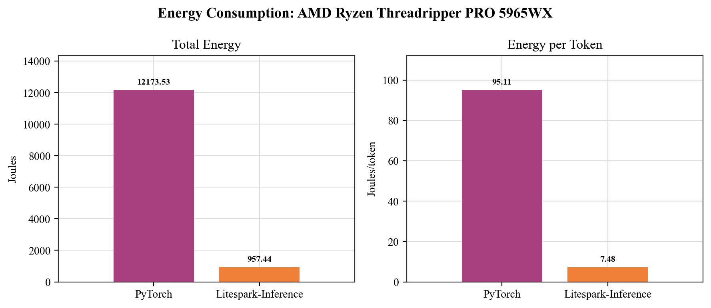
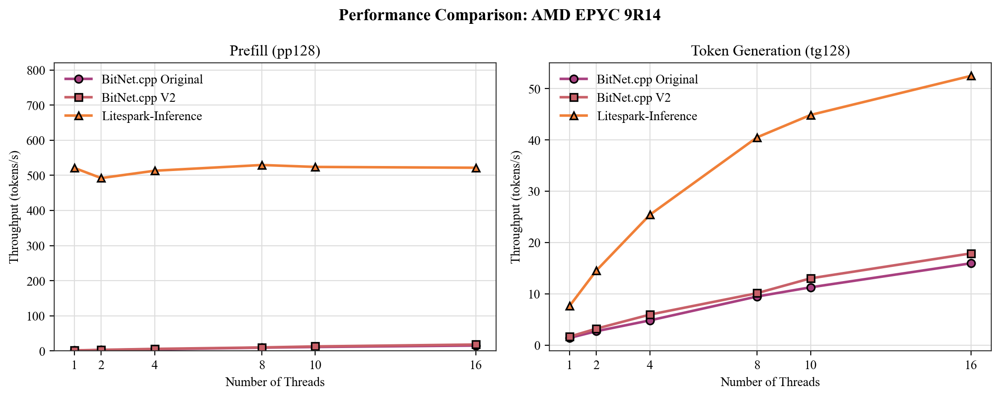
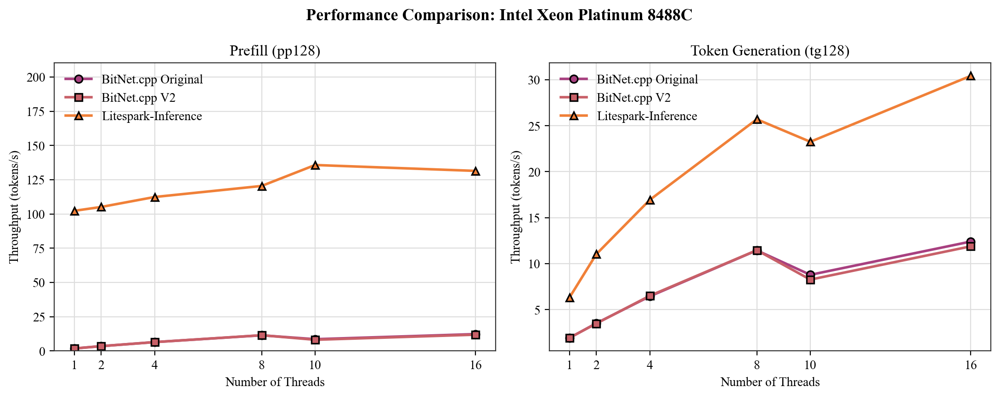

# Litespark-Inference

**Fast CPU inference for ternary neural networks**

Litespark-Inference is a pip-installable Python library that enables efficient inference of ternary models on consumer CPUs. By exploiting the ternary weight structure ({-1, 0, +1}) with custom SIMD kernels, we eliminate floating-point multiplication entirely and achieve dramatic speedups over standard PyTorch inference.

## Key Results

### Apple Silicon (M1-M5)


*Performance comparison on Apple Silicon M5. Litespark-Inference achieves ~5.8x memory reduction, 6.66x faster TTFT, and 12.57x higher throughput compared to PyTorch. Accelerate is an Apple-only float32 accuracy mode and uses more memory than the packed NEON path.*

<div align="center">

| Metric | PyTorch | NEON | Accelerate |
|--------|---------|------|------------|
| Memory (MB) | 4,601.55 | 793.34 | 8,558.44 |
| TTFT (ms) | 3,160.13 | 474.44 | 8,399.13 |
| Throughput (tok/s) | 3.13 | 39.35 | 14.79 |

</div>

### Intel Ice Lake / AMD Zen4 (AVX-512 VNNI)


*Performance comparison on Intel Ice Lake / AMD Zen4 using AVX-512 VNNI kernels.*

<div align="center">

| Metric | PyTorch | AVX-512 VNNI | Improvement |
|--------|---------|--------------|-------------|
| Memory (MB) | 4,601.55 | 775.84 | 5.93x |
| TTFT (ms) | 6,933.36 | 1,126.12 | 6.16x |
| Throughput (tok/s) | 0.41 | 27.16 | 66.24x |

</div>

### Intel Core Ultra (AVX-VNNI)


*Performance comparison on Intel Core Ultra using AVX-VNNI kernels.*

<div align="center">

| Metric | PyTorch | AVX-VNNI | Improvement |
|--------|---------|----------|-------------|
| Memory (MB) | 4,601.55 | 775.84 | 5.93x |
| TTFT (ms) | 7,173.05 | 1,134.48 | 6.32x |
| Throughput (tok/s) | 0.41 | 39.96 | 97.46x |

</div>

### Cross-Platform Comparison


*Cross-platform performance comparison showing TTFT, throughput, and memory-efficiency improvements across Apple Silicon, Intel, and AMD processors.*

### Energy Consumption





<div align="center">

| System | Metric | PyTorch | Litespark | Improvement |
|--------|--------|---------|-----------|-------------|
| Apple M5 Max | Total energy (J) | 606.46 | 101.45 | 5.98x |
| Apple M5 Max | Energy/token (J) | 4.74 | 0.79 | 5.98x |
| AMD Ryzen Threadripper PRO 5965WX | Total energy (J) | 12,173.53 | 957.44 | 12.71x |
| AMD Ryzen Threadripper PRO 5965WX | Energy/token (J) | 95.11 | 7.48 | 12.71x |

</div>

## Comparison with BitNet.cpp v2

We benchmarked Litespark-Inference against Microsoft's BitNet.cpp v2 using their pp128+tg128 methodology (128-token prompt processing + 128-token generation), batch size 1.
The paper follows Microsoft's `e2e_benchmark.py` script for this setup; "V2" refers to Microsoft's 01/15/2026 BitNet CPU Inference Optimization update.

### AMD EPYC 9R14 (AWS c7a.4xlarge)



*Scaling behavior on AMD EPYC 9R14. Litespark-Inference leads both BitNet.cpp Original and BitNet.cpp V2 across the tested thread counts.*

<div align="center">

| Threads | Prefill Original | Prefill V2 | Prefill Litespark | Gen Original | Gen V2 | Gen Litespark |
|---------|------------------|------------|-------------------|--------------|--------|---------------|
| 1 | 1.40 | 1.67 | **520.96** | 1.42 | 1.67 | **7.67** |
| 2 | 2.70 | 3.22 | **492.16** | 2.72 | 3.22 | **14.56** |
| 4 | 4.82 | 5.98 | **513.08** | 4.83 | 5.96 | **25.42** |
| 8 | 9.45 | 10.11 | **529.36** | 9.48 | 10.13 | **40.49** |
| 10 | 11.36 | 13.05 | **523.91** | 11.27 | 13.02 | **44.86** |
| 16 | 15.47 | 18.35 | **521.59** | 15.96 | 17.89 | **52.49** |

</div>

### Intel Xeon Platinum 8488C (AWS c7i.4xlarge)



*Scaling behavior on Intel Xeon Platinum 8488C. Litespark-Inference maintains higher prefill and token-generation throughput across the tested thread counts.*

<div align="center">

| Threads | Prefill Original | Prefill V2 | Prefill Litespark | Gen Original | Gen V2 | Gen Litespark |
|---------|------------------|------------|-------------------|--------------|--------|---------------|
| 1 | 1.84 | 1.82 | **102.30** | 1.92 | 1.93 | **6.32** |
| 2 | 3.52 | 3.51 | **105.11** | 3.51 | 3.48 | **11.02** |
| 4 | 6.47 | 6.47 | **112.38** | 6.44 | 6.50 | **16.93** |
| 8 | 11.44 | 11.49 | **120.44** | 11.44 | 11.46 | **25.70** |
| 10 | 8.61 | 8.18 | **135.73** | 8.78 | 8.26 | **23.25** |
| 16 | 12.32 | 11.89 | **131.43** | 12.40 | 11.88 | **30.43** |

</div>

### Apple M5 (MacBook Pro)


*Litespark-Inference scaling on Apple M5. Prefill throughput continues scaling through 16 threads, while token generation gains quickly and then flattens out.*

<div align="center">

| Threads | Prefill pp128 (tok/s) | Generation tg128 (tok/s) |
|---------|----------------------|--------------------------|
| 1 | 50.52 | 10.98 |
| 2 | 91.55 | 19.46 |
| 4 | 152.09 | 33.29 |
| 8 | 194.23 | 35.81 |
| 10 | 218.88 | 37.44 |
| 16 | 262.59 | 37.92 |

</div>

## Supported Platforms

- **Apple Silicon** (M1/M2/M3/M4/M5) — NEON SDOT instructions
- **Intel Ice Lake+** — AVX-512 VNNI instructions
- **AMD Zen4+** — AVX-512 VNNI instructions
- **Intel Core Ultra** — AVX-VNNI (256-bit) instructions
- **AMD Zen 2–3 / pre-Skylake-X Intel** — AVX2 + FMA fallback (256-bit, no VNNI fast path)

## Installation

```bash
pip install litespark-inference
```

**Requirements:**
- Python 3.10+
- PyTorch 2.4+

**macOS (recommended):**
```bash
brew install libomp
```
OpenMP enables multi-threaded kernel execution. Without it, inference will run single-threaded.

The torchless runtime ships as a setuptools extension and is built
during `pip install`. No JIT compile happens at first inference; you
do need a C++ compiler available at install time (Xcode CLT on macOS,
`build-essential` on Linux).

## Torchless Runtime

`litespark-inference` ships with a **torchless** runtime for the supported
BitNet and Falcon Edge models. It reads safetensors directly, stores ternary
weights in the native packed format used by the SIMD kernels, owns the KV
cache, and does not import `torch` for inference. The CLI dispatches to it
automatically:

```bash
litespark-inference generate "Hello, how are you?"
# [litespark-inference] torchless runtime (model=bitnet-2b).
```

Or invoke the torchless CLI directly:

```bash
python -m litespark_inference.torchless generate "Hello, how are you?" --max-tokens 32 --raw
python -m litespark_inference.torchless info
```

### Headline numbers vs the PyTorch baseline (Apple Silicon M5, bitnet-2b)

Same prompt, same workload (pp128 + tg128), measured with
`benchmark_kernel.py --inference --pytorch`:

| Metric | PyTorch bf16 | **Litespark torchless (int4)** | Speedup |
|---|---|---|---|
| Peak RSS | 4,601.55 MB | **793.34 MB** | **5.80×** |
| TTFT (pp128) | 3.16 s | **0.47 s** | **6.66×** |
| Throughput (tg128) | 3.13 tok/s | **39.35 tok/s** | **12.57×** |

Torchless generation is greedy-only today. Sampling flags are accepted by the
CLI for compatibility but ignored on torchless routes; set
`LITESPARK_FORCE_TORCH=1` to force the legacy torch-backed path when sampling
is required.

## Usage

### Supported Models

- `bitnet-2b`
- `falcon-edge-1b`
- `falcon-edge-1b-instruct`
- `falcon-edge-3b`
- `falcon-edge-3b-instruct`

### Command Line

```bash
# Generate text with the default BitNet model
litespark-inference generate "The meaning of life is"

# Generate text with Falcon Edge instruct
litespark-inference generate "What is the capital of France?" --model falcon-edge-1b-instruct

# Interactive chat with Falcon Edge instruct
litespark-inference chat --model falcon-edge-1b-instruct

# Run benchmark on your hardware
litespark-inference benchmark

# Show system info and detected SIMD capabilities
litespark-inference info
```

### Python API

```python
from litespark_inference import load_model

# Load the default BitNet 2B model (auto-downloads from Hugging Face)
model, tokenizer = load_model("bitnet-2b")

# Generate text
input_ids = tokenizer.encode("Hello, world!", return_tensors="pt")
output = model.generate(input_ids, max_new_tokens=100)
print(tokenizer.decode(output[0]))

# Load a Falcon Edge instruct model
falcon_model, falcon_tokenizer = load_model("falcon-edge-1b-instruct")
```

### Kernel Modes (Apple Silicon)

Two inference modes are available on Apple Silicon:

```bash
# NEON mode (default) — packed torchless inference, ~0.8 GB on BitNet-2B
litespark-inference generate "Hello" --mode neon

# Accelerate mode — Apple-only float32 accuracy mode, higher memory
litespark-inference generate "Hello" --mode accelerate
```

```python
# In Python
model, tokenizer = load_model("bitnet-2b", mode="neon")       # default, fast
model, tokenizer = load_model("bitnet-2b", mode="accelerate") # accurate
```

## How It Works

Ternary models use weights constrained to {-1, 0, +1}. This means matrix multiplication reduces to simple addition and subtraction:

```
y = Σ x_j · w_j  →  y = Σ(w=+1) x_j - Σ(w=-1) x_j
```

Litespark-Inference exploits this structure with custom SIMD kernels that:

1. **Store weights as int8** — enabling direct use of hardware dot product instructions
2. **Quantize activations per-row** — converting float32 inputs to int8 with scale factors
3. **Use hardware SIMD instructions** — NEON SDOT (ARM) or AVX-512 VPDPBUSD (x86)
4. **Apply zero-point correction** — maintaining numerical accuracy

The library automatically detects your CPU's SIMD capabilities and dispatches to the optimal kernel.

## Benchmarking

Run the built-in benchmark to measure performance on your hardware:

```bash
litespark-inference benchmark
```

Repo-level benchmarks for detailed profiling:

```bash
# Litespark (torchless by default for bitnet-2b) vs the PyTorch baseline,
# pp128 + tg128, both runtimes' RSS captured. ~6 min total.
python benchmark_kernel.py --inference --pytorch

# Quick torchless-only inference benchmark, no PyTorch baseline.
python benchmark_kernel.py --inference --no-matrix

# Full sweep: matrix + thread-scaling + inference (each torch-backed
# kernel phase runs in its own subprocess so torch's libomp never
# coexists with our libomp).
python benchmark_kernel.py --all

# Raw kernel benchmarks (matrix shapes, scaling) standalone.
python benchmark_kernel.py
```

### ARM compatibility tests

The `tests/arm_compat/` folder ships ARM's three validation scripts
(`benchmark_litespark.py`, `benchmark_transformers.py`,
`benchmark_repeat_v2.py`) plus their original instructions. After
`pip install -e .` they run with no environment variables and no edits:

```bash
python tests/arm_compat/benchmark_repeat_v2.py
```

This produces the canonical ARM "transformers vs litespark" comparison
under `/usr/bin/time` (Darwin or Linux), aggregated across 5 runs, with
`.log` and `.csv` artefacts dropped in `benchmark_logs/`. See
[`tests/arm_compat/README.md`](tests/arm_compat/README.md) for details.

## Citation

If you use Litespark-Inference in your research, please cite:

```bibtex
@article{litespark2026,
  title={Litespark Inference on Consumer CPUs: Custom SIMD Kernels for Ternary Neural Networks},
  author={Dade, Nii Osae Osae and Morri, Tony and Rahat, Moinul Hossain and Pal, Sayandip},
  year={2026}
}
```

## License

Apache License 2.0. See [LICENSE](LICENSE) for details.
