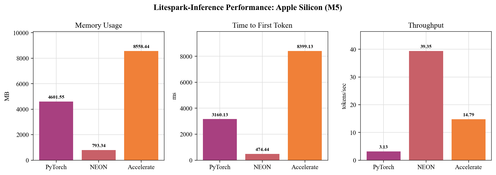
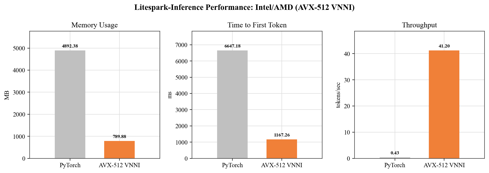
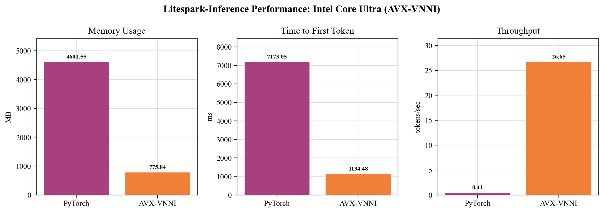
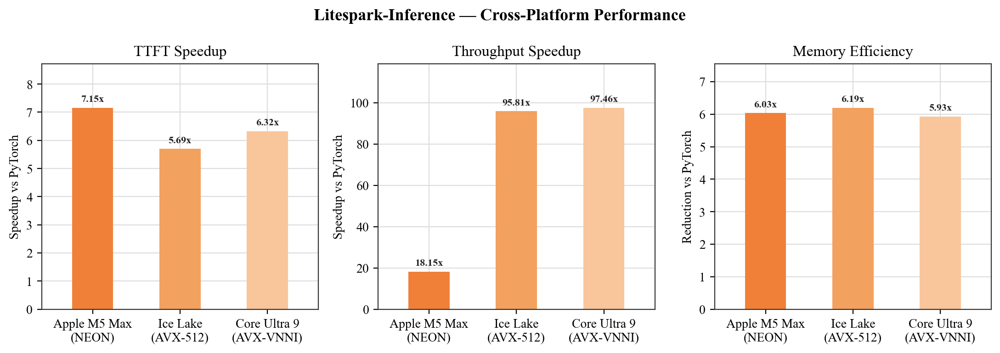
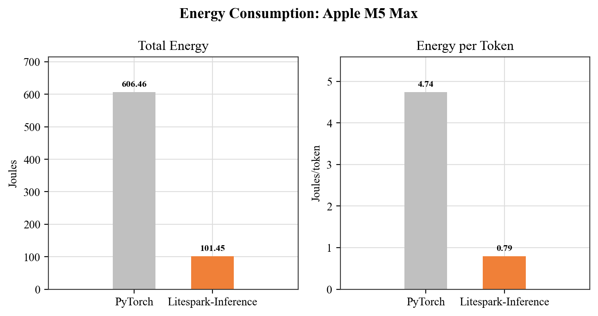
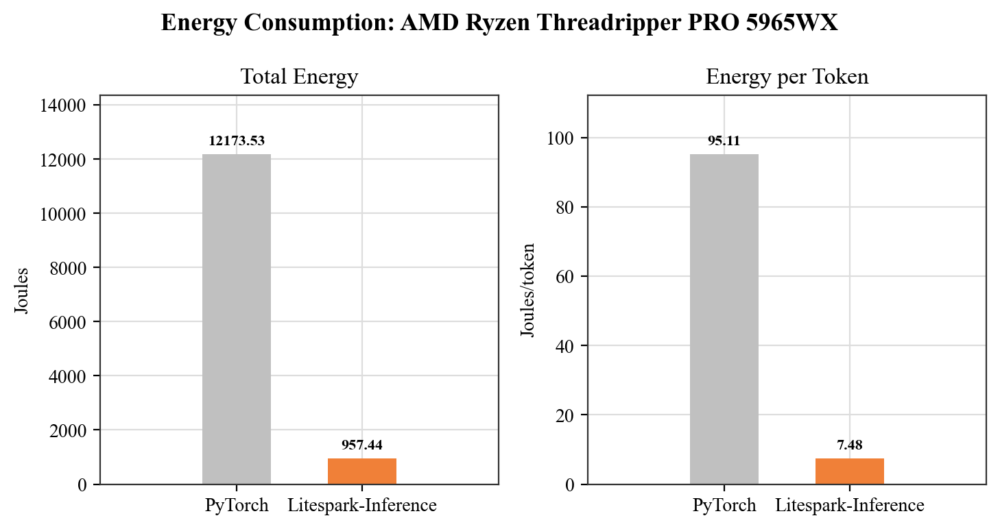
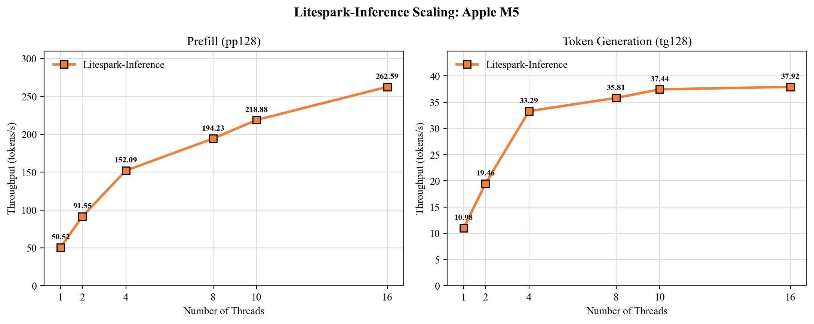

# Litespark-Inference

**Fast CPU inference for ternary neural networks**

Litespark-Inference is a pip-installable Python library that enables efficient inference of ternary models on consumer CPUs. By exploiting the ternary weight structure ({-1, 0, +1}) with custom SIMD kernels, we eliminate floating-point multiplication entirely and achieve dramatic speedups over standard PyTorch inference.

## Key Results

### Apple Silicon (M1-M5)



*Performance comparison on Apple Silicon M5 Max. Litespark-Inference achieves 6.03x memory reduction, 7.15x faster TTFT, and 18.15x higher throughput compared to PyTorch.*

<div align="center">

| Metric | PyTorch | NEON | Improvement |
|--------|---------|------|-------------|
| Memory (MB) | 4,868.22 | 806.81 | 6.03x |
| TTFT (ms) | 4,213.92 | 589.02 | 7.15x |
| Throughput (tok/s) | 2.20 | 39.92 | 18.15x |

</div>

### Intel Ice Lake / AMD Zen4 (AVX-512 VNNI)



*Performance comparison on Intel Ice Lake / AMD Zen4 using AVX-512 VNNI kernels.*

<div align="center">

| Metric | PyTorch | AVX-512 VNNI | Improvement |
|--------|---------|--------------|-------------|
| Memory (MB) | 4,892.38 | 789.88 | 6.19x |
| TTFT (ms) | 6,647.18 | 1,167.26 | 5.69x |
| Throughput (tok/s) | 0.43 | 41.20 | 95.81x |

</div>

### Intel Core Ultra (AVX-VNNI)



*Performance comparison on Intel Core Ultra using AVX-VNNI kernels.*

<div align="center">

| Metric | PyTorch | AVX-VNNI | Improvement |
|--------|---------|----------|-------------|
| Memory (MB) | 4,601.55 | 775.84 | 5.93x |
| TTFT (ms) | 7,173.05 | 1,134.48 | 6.32x |
| Throughput (tok/s) | 0.41 | 39.96 | 97.46x |

</div>

### Cross-Platform Comparison



*Cross-platform performance comparison showing TTFT, throughput, and memory-efficiency improvements across Apple Silicon, Intel, and AMD processors.*

### Energy Consumption





<div align="center">

| System | Metric | PyTorch | Litespark | Improvement |
|--------|--------|---------|-----------|-------------|
| Apple M5 Max | Total energy (J) | 606.46 | 101.45 | 5.98x |
| Apple M5 Max | Energy/token (J) | 4.74 | 0.79 | 5.98x |
| AMD Ryzen Threadripper PRO 5965WX | Total energy (J) | 12,173.53 | 957.44 | 12.71x |
| AMD Ryzen Threadripper PRO 5965WX | Energy/token (J) | 95.11 | 7.48 | 12.71x |

</div>

## Thread Scaling

We also measured Litespark-Inference with the pp128+tg128 protocol across thread counts, separating prompt prefill from autoregressive token generation.

### AMD EPYC 9R14 (AWS c7a.4xlarge)

<div align="center">

| Threads | Prefill pp128 (tok/s) | Generation tg128 (tok/s) |
|---------|-----------------------|--------------------------|
| 1 | 520.96 | 7.67 |
| 2 | 492.16 | 14.56 |
| 4 | 513.08 | 25.42 |
| 8 | 529.36 | 40.49 |
| 10 | 523.91 | 44.86 |
| 16 | 521.59 | 52.49 |

</div>

### Intel Xeon Platinum 8488C (AWS c7i.4xlarge)

<div align="center">

| Threads | Prefill pp128 (tok/s) | Generation tg128 (tok/s) |
|---------|-----------------------|--------------------------|
| 1 | 102.30 | 6.32 |
| 2 | 105.11 | 11.02 |
| 4 | 112.38 | 16.93 |
| 8 | 120.44 | 25.70 |
| 10 | 135.73 | 23.25 |
| 16 | 131.43 | 30.43 |

</div>

### Apple M5 Max (MacBook Pro)



*Litespark-Inference scaling on Apple M5 Max. Prefill throughput continues scaling through 16 threads, while token generation gains quickly and then flattens out.*

<div align="center">

| Threads | Prefill pp128 (tok/s) | Generation tg128 (tok/s) |
|---------|----------------------|--------------------------|
| 1 | 50.52 | 10.98 |
| 2 | 91.55 | 19.46 |
| 4 | 152.09 | 33.29 |
| 8 | 194.23 | 35.81 |
| 10 | 218.88 | 37.44 |
| 16 | 262.59 | 37.92 |

</div>

## Supported Platforms

- **Apple Silicon** (M1/M2/M3/M4/M5) — NEON SDOT instructions
- **Intel Ice Lake+** — AVX-512 VNNI instructions
- **AMD Zen4+** — AVX-512 VNNI instructions
- **Intel Core Ultra** — AVX-VNNI (256-bit) instructions
- **AMD Zen 2–3 / pre-Skylake-X Intel** — AVX2 + FMA fallback (256-bit, no VNNI fast path)

## Installation

```bash
pip install litespark-inference
```

**Requirements:**
- Python 3.10+
- PyTorch 2.4+

**macOS (recommended):**
```bash
brew install libomp
```
OpenMP enables multi-threaded kernel execution. Without it, inference will run single-threaded.

The torchless runtime ships as a setuptools extension and is built
during `pip install`. No JIT compile happens at first inference; you
do need a C++ compiler available at install time (Xcode CLT on macOS,
`build-essential` on Linux).

**From source (development):**
```bash
git clone https://github.com/Mindbeam-AI/Litespark-Inference.git
cd Litespark-Inference
pip install -e .
```
An editable install lets you modify the Python runtime and kernels in place. The
native extension still builds at install time, so re-run `pip install -e .` after
changing the C++ kernel sources.

## Torchless Runtime

`litespark-inference` ships with a **torchless** runtime for the supported
BitNet and Falcon Edge models. It reads safetensors directly, stores ternary
weights in the native packed format used by the SIMD kernels, owns the KV
cache, and does not import `torch` for inference. The CLI dispatches to it
automatically:

```bash
litespark-inference generate "Hello, how are you?"
# [litespark-inference] torchless runtime (model=bitnet-2b).
```

Or invoke the torchless CLI directly:

```bash
python -m litespark_inference.torchless generate "Hello, how are you?" --max-tokens 32 --raw
python -m litespark_inference.torchless info
```

### Headline numbers vs the PyTorch baseline (Apple Silicon M5 Max, bitnet-2b)

Same prompt, same workload (pp128 + tg128), measured with
`litespark-benchmark --inference --pytorch`:

| Metric | PyTorch bf16 | **Litespark torchless (int4)** | Speedup |
|---|---|---|---|
| Peak RSS | 4,868.22 MB | **806.81 MB** | **6.03×** |
| TTFT (pp128) | 4.21 s | **0.59 s** | **7.15×** |
| Throughput (tg128) | 2.20 tok/s | **39.92 tok/s** | **18.15×** |

Torchless generation is greedy-only today. Sampling flags are accepted by the
CLI for compatibility but ignored on torchless routes; set
`LITESPARK_FORCE_TORCH=1` to force the legacy torch-backed path when sampling
is required.

## Usage

### Supported Models

- `bitnet-2b`
- `falcon-edge-1b`
- `falcon-edge-1b-instruct`
- `falcon-edge-3b`
- `falcon-edge-3b-instruct`

### Command Line

```bash
# Generate text with the default BitNet model
litespark-inference generate "The meaning of life is"

# Generate text with Falcon Edge instruct
litespark-inference generate "What is the capital of France?" --model falcon-edge-1b-instruct

# Interactive chat with Falcon Edge instruct
litespark-inference chat --model falcon-edge-1b-instruct

# Run benchmark on your hardware
litespark-inference benchmark

# Show system info and detected SIMD capabilities
litespark-inference info
```

### Python API

The torchless runtime is the recommended path — pure numpy plus the native
SIMD kernels, with **no `torch` import at inference**.

**BitNet-2B** has a high-level class:

```python
from litespark_inference.torchless import BitNet

# Auto-downloads from Hugging Face on first use
bn = BitNet.from_pretrained("bitnet-2b")

# chat=True applies the system + chat template and strips the prompt,
# giving a clean instruction-following answer (omit it for raw continuation).
print(bn.generate("Write a short poem about Austin", max_new_tokens=100, chat=True))
```

**Falcon Edge** uses the lower-level torchless functions (no high-level
class yet):

```python
from litespark_inference.torchless import (
    FALCON_TORCHLESS_REPOS, load_falcon_edge, load_tokenizer,
)
from litespark_inference.torchless.runtime import falcon_generate

name = "falcon-edge-1b-instruct"
model = load_falcon_edge(name)                          # auto-downloads
tokenizer = load_tokenizer(FALCON_TORCHLESS_REPOS[name])

# format_chat applies the system + chat template for the instruct models
prompt = tokenizer.format_chat("What is the capital of France?")
ids = tokenizer.encode(prompt)
out = falcon_generate(model, ids, max_new_tokens=64)
print(tokenizer.decode(out))
```

> `from litespark_inference import load_model` is the **legacy torch-backed**
> path — it imports PyTorch and runs the dense float baseline. Prefer the
> torchless API above for fast, low-memory CPU inference; reach for
> `load_model` (or `LITESPARK_FORCE_TORCH=1`) only when you specifically
> need the torch path, e.g. for sampling.

### Kernel Mode (Apple Silicon)

NEON is the default optimized path on Apple Silicon:

```bash
# NEON mode (default) — packed torchless inference, ~0.8 GB on BitNet-2B
litespark-inference generate "Hello" --mode neon
```

```python
# In Python — NEON is automatic; BitNet.from_pretrained() already uses it.
from litespark_inference.torchless import BitNet
bn = BitNet.from_pretrained("bitnet-2b")   # NEON SDOT kernel, ~0.8 GB
```

## How It Works

Ternary models use weights constrained to {-1, 0, +1}. This means matrix multiplication reduces to simple addition and subtraction:

```
y = Σ x_j · w_j  →  y = Σ(w=+1) x_j - Σ(w=-1) x_j
```

Litespark-Inference exploits this structure with custom SIMD kernels that:

1. **Store weights as int8** — enabling direct use of hardware dot product instructions
2. **Quantize activations per-row** — converting float32 inputs to int8 with scale factors
3. **Use hardware SIMD instructions** — NEON SDOT (ARM) or AVX-512 VPDPBUSD (x86)
4. **Apply zero-point correction** — maintaining numerical accuracy

The library automatically detects your CPU's SIMD capabilities and dispatches to the optimal kernel.

## Benchmarking

Run the built-in benchmark to measure performance on your hardware:

```bash
litespark-inference benchmark
```

> **Note:** `litespark-inference benchmark` is the quick built-in benchmark; it
> only accepts `--model`, `--tokens`, and `--mode`. The detailed profiling flags
> (`--inference`, `--pytorch`, `--all`, `--no-matrix`, …) belong to the separate
> **`litespark-benchmark`** command and are *not* recognized by
> `litespark-inference benchmark`.

The `litespark-benchmark` command (installed with the package) runs the
detailed profiling benchmarks:

```bash
# Litespark (torchless by default for bitnet-2b) vs the PyTorch baseline,
# pp128 + tg128, both runtimes' RSS captured. ~6 min total.
litespark-benchmark --inference --pytorch

# Quick torchless-only inference benchmark, no PyTorch baseline.
litespark-benchmark --inference --no-matrix

# Full sweep: matrix + thread-scaling + inference (each torch-backed
# kernel phase runs in its own subprocess so torch's libomp never
# coexists with our libomp).
litespark-benchmark --all

# Raw kernel benchmarks (matrix shapes, scaling) standalone.
litespark-benchmark
```

## Citation

If you use Litespark-Inference in your research, please cite:

```bibtex
@article{litespark2026,
  title={Litespark Inference on Consumer CPUs: Custom SIMD Kernels for Ternary Neural Networks},
  author={Dade, Nii Osae Osae and Morri, Tony and Rahat, Moinul Hossain and Pal, Sayandip},
  year={2026}
}
```

## License

Apache License 2.0. See [LICENSE](LICENSE) for details.
