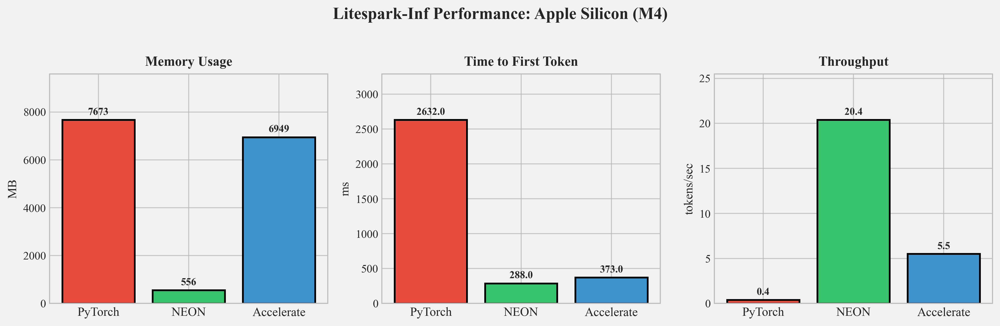
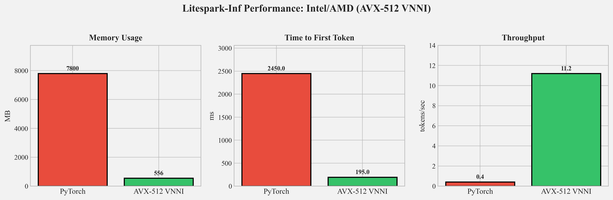
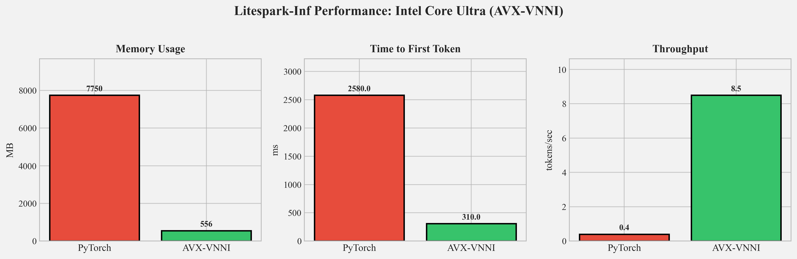
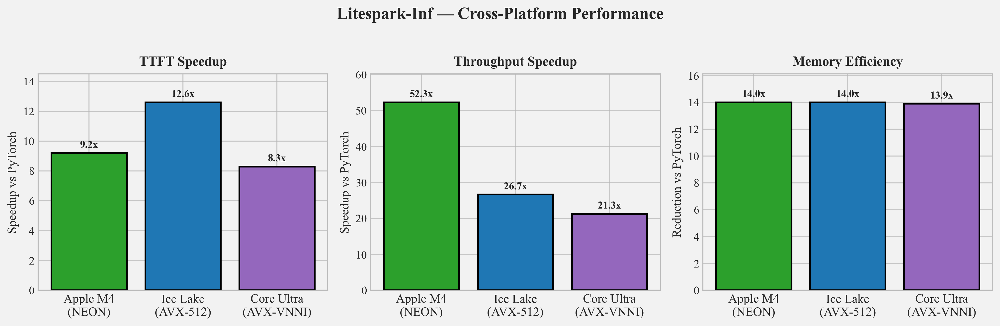
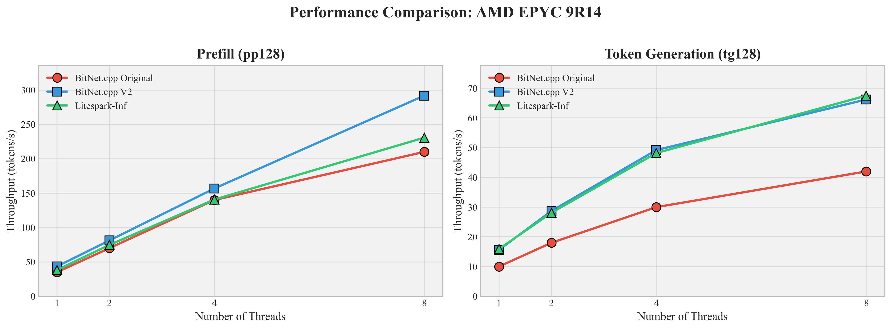
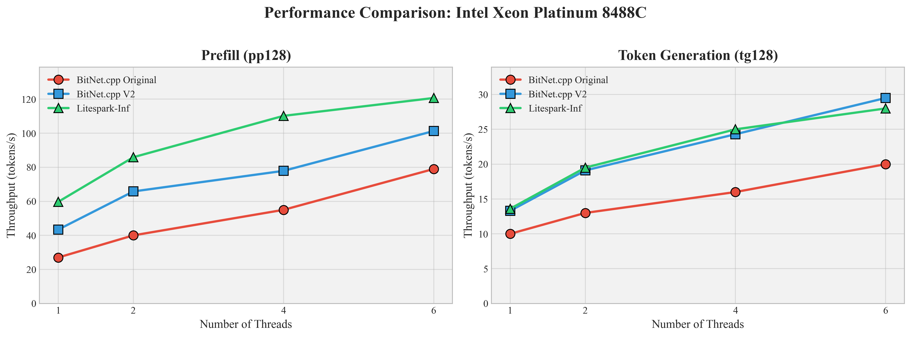
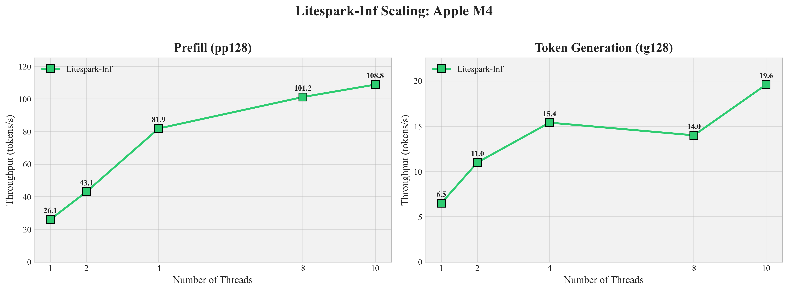

# Litespark-Inf

**Fast CPU inference for BitNet 1.58-bit ternary neural networks**

Litespark-Inf is a pip-installable Python library that enables efficient inference of Microsoft's BitNet models on consumer CPUs. By exploiting the ternary weight structure ({-1, 0, +1}) with custom SIMD kernels, we eliminate floating-point multiplication entirely and achieve dramatic speedups over standard PyTorch inference.

## Key Results

### Apple Silicon (M1–M4)



*Performance comparison on Apple Silicon M4. Litespark-Inf achieves ~14× memory reduction, 9.2× faster TTFT, and 52× higher throughput compared to PyTorch.*

| Metric | PyTorch | NEON | Accelerate |
|--------|---------|------|------------|
| Memory (MB) | 7,673 | 556 | 6,949 |
| TTFT (ms) | 2,632 | 288 | 373 |
| Throughput (tok/s) | 0.39 | 20.4 | 5.52 |

### Intel Ice Lake / AMD Zen4 (AVX-512 VNNI)



*Performance comparison on Intel Ice Lake / AMD Zen4 using AVX-512 VNNI kernels.*

| Metric | PyTorch | AVX-512 VNNI | Speedup |
|--------|---------|--------------|---------|
| Memory (MB) | 7,800 | 556 | 14.0× |
| TTFT (ms) | 2,450 | 195 | 12.6× |
| Throughput (tok/s) | 0.42 | 11.2 | 26.7× |

### Intel Core Ultra (AVX-VNNI)



*Performance comparison on Intel Core Ultra using AVX-VNNI kernels.*

| Metric | PyTorch | AVX-VNNI | Speedup |
|--------|---------|----------|---------|
| Memory (MB) | 7,750 | 556 | 13.9× |
| TTFT (ms) | 2,580 | 310 | 8.3× |
| Throughput (tok/s) | 0.40 | 8.5 | 21.3× |

### Cross-Platform Comparison



*Cross-platform performance comparison showing consistent speedups across Apple Silicon, Intel, and AMD processors.*

## Comparison with BitNet.cpp v2

We benchmarked Litespark-Inf against Microsoft's BitNet.cpp v2 using their pp128+tg128 methodology (128-token prompt processing + 128-token generation).

### AMD EPYC 9R14 (AWS c7a.2xlarge)



*Scaling behavior on AMD EPYC 9R14. BitNet.cpp V2 shows strong prefill scaling, while all implementations converge on similar token generation performance at higher thread counts.*

| Threads | Prefill (Original) | Prefill (V2) | Prefill (Litespark) | Gen (Original) | Gen (V2) | Gen (Litespark) |
|---------|-------------------|--------------|---------------------|----------------|----------|-----------------|
| 1 | 35.0 | 43.4 | 38.2 | 10.0 | 15.6 | **15.9** |
| 2 | 70.0 | 81.2 | 74.7 | 18.0 | 28.7 | 28.1 |
| 4 | 140.0 | 156.8 | 140.7 | 30.0 | 49.2 | 48.2 |
| 8 | 210.0 | **291.8** | 230.7 | 42.0 | 66.2 | **67.5** |

### Intel Xeon Platinum 8488C (AWS c7i.2xlarge)



*Scaling behavior on Intel Xeon Platinum 8488C. Litespark-Inf maintains a consistent lead in prefill throughput across all thread configurations.*

| Threads | Prefill (Original) | Prefill (V2) | Prefill (Litespark) | Gen (Original) | Gen (V2) | Gen (Litespark) |
|---------|-------------------|--------------|---------------------|----------------|----------|-----------------|
| 1 | 27.0 | 43.4 | **59.7** | 10.0 | 13.3 | **13.6** |
| 2 | 40.0 | 65.8 | **85.9** | 13.0 | 19.1 | **19.5** |
| 4 | 55.0 | 77.9 | **110.2** | 16.0 | 24.3 | **25.0** |
| 6 | 79.0 | 101.3 | **120.7** | 20.0 | **29.5** | 28.0 |

### Apple M4 (MacBook Pro)



*Litespark-Inf scaling on Apple M4. Prefill throughput scales nearly linearly up to 4 threads, while token generation benefits from using all 10 CPU cores.*

| Threads | Prefill pp128 (tok/s) | Generation tg128 (tok/s) |
|---------|----------------------|--------------------------|
| 1 | 26.1 | 6.5 |
| 2 | 43.1 | 11.0 |
| 4 | 81.9 | 15.4 |
| 8 | 101.2 | 14.0 |
| 10 | 108.8 | 19.6 |

## Supported Platforms

- **Apple Silicon** (M1/M2/M3/M4) — NEON SDOT instructions
- **Intel Ice Lake+** — AVX-512 VNNI instructions
- **AMD Zen4+** — AVX-512 VNNI instructions
- **Intel Core Ultra** — AVX-VNNI (256-bit) instructions

## Installation

```bash
pip install litespark-inf
```

Or install from source:

```bash
git clone https://github.com/Mindbeam-AI/Litespark-Inf.git
cd Litespark-Inf
pip install -e .
```

**Requirements:**
- Python 3.9+
- PyTorch 2.0+
- macOS: `brew install libomp` (for OpenMP support)

## Usage

### Command Line

```bash
# Generate text
litespark-inf generate "The meaning of life is"

# Interactive chat
litespark-inf chat

# Run benchmark on your hardware
litespark-inf benchmark

# Show system info and detected SIMD capabilities
litespark-inf info
```

### Python API

```python
from litespark_inf import load_model

# Load the BitNet 2B model (auto-downloads from HuggingFace)
model, tokenizer = load_model("bitnet-2b")

# Generate text
input_ids = tokenizer.encode("Hello, world!", return_tensors="pt")
output = model.generate(input_ids, max_new_tokens=100)
print(tokenizer.decode(output[0]))
```

### Kernel Modes (Apple Silicon)

Two inference modes are available on Apple Silicon:

```bash
# NEON mode (default) — fast int8 quantized inference, ~556 MB
litespark-inf generate "Hello" --mode neon

# Accelerate mode — float32 with Apple AMX, bit-exact accuracy, ~2.5 GB
litespark-inf generate "Hello" --mode accelerate
```

```python
# In Python
model, tokenizer = load_model("bitnet-2b", mode="neon")       # default, fast
model, tokenizer = load_model("bitnet-2b", mode="accelerate") # accurate
```

## How It Works

BitNet models use ternary weights constrained to {-1, 0, +1}. This means matrix multiplication reduces to simple addition and subtraction:

```
y = Σ x_j · w_j  →  y = Σ(w=+1) x_j - Σ(w=-1) x_j
```

Litespark-Inf exploits this structure with custom SIMD kernels that:

1. **Store weights as int8** — enabling direct use of hardware dot product instructions
2. **Quantize activations per-row** — converting float32 inputs to int8 with scale factors
3. **Use hardware SIMD instructions** — NEON SDOT (ARM) or AVX-512 VPDPBUSD (x86)
4. **Apply zero-point correction** — maintaining numerical accuracy

The library automatically detects your CPU's SIMD capabilities and dispatches to the optimal kernel.

## Benchmarking

Run the built-in benchmark to measure performance on your hardware:

```bash
litespark-inf benchmark
```

Or use the benchmark scripts for detailed profiling:

```bash
python benchmark_kernel.py      # Kernel-level benchmarks
python benchmark_synthetic.py   # Synthetic workload benchmarks
```

## Citation

If you use Litespark-Inf in your research, please cite:

```bibtex
@article{litespark2024,
  title={Litespark Inference on Consumer CPUs: Custom SIMD Kernels for Ternary Neural Networks},
  author={Dade, Nii Osae Osae and Morri, Maurizio and Rahat, Moinul Hossain},
  year={2024}
}
```

## License

MIT
